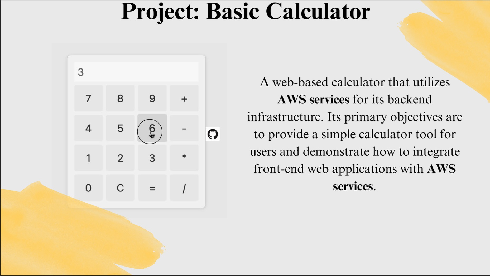
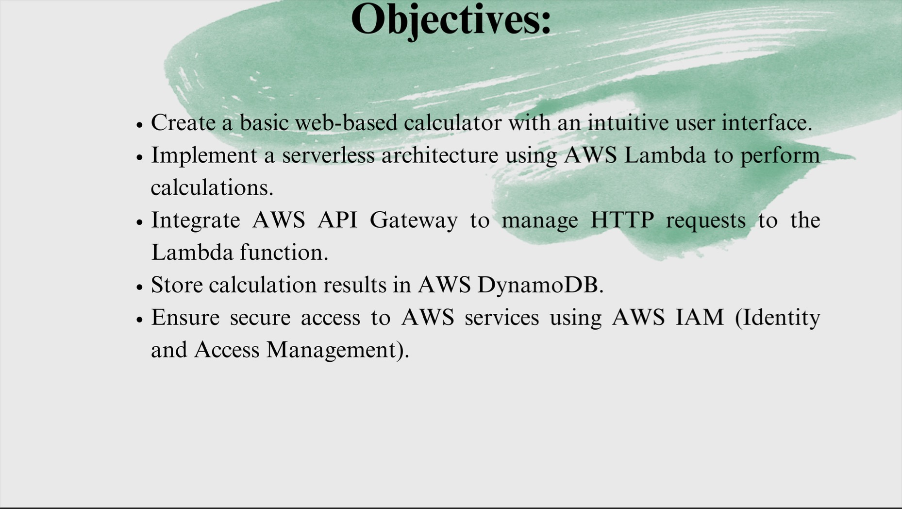
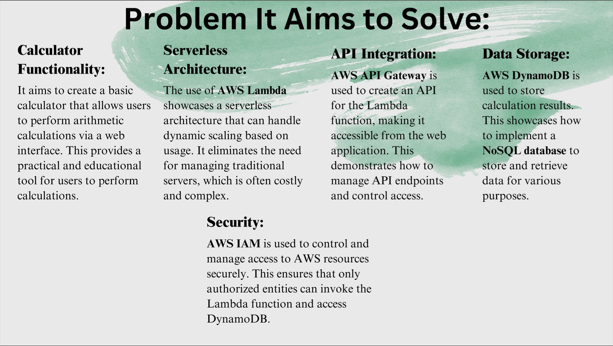

# Calculator-WebApp
The project serves as a practical example of building a serverless web application with AWS services. It aims to provide a fully functional calculator while highlighting best practices in terms of serverless architecture, API management, data storage, and security. Users can perform calculations, and the results are stored in DynamoDB, allowing for future retrieval and analysis. Additionally, AWS IAM ensures that only authorized actions can be taken on AWS resources, enhancing the security of the application.
# Prerequisites
- A Basic understanding of AWS or cloud computing in general.
- A Working AWS account or access to AWS console.
# AWS Services Used
- AWS LAMBDA
- AWS DYNAMO DB
- AWS API GATEWAY
- AWS IAM
- AWS AMPLIFY
# WebAPP
🔗: https://dev.d32mtbsnsb1weo.amplifyapp.com/

# Overview

# Objectives

# Problems It Aims to Solve

# Helpful links
🔗: https://youtu.be/7m_q1ldzw0U?si=6hcrZxbc8j6vXHZV
